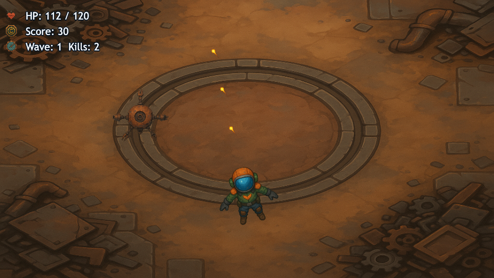

# LootForge

LootForge is a manifest-driven CLI for generating and packaging runtime-ready game image assets.

Current version: `0.1.0`

## Try the Playable Demo in 2 Minutes

```bash
npm install --cache .npm-cache
npm run demo:dev
```

Open `http://localhost:5173` and play immediately (no API keys required).

Gameplay screenshot:


It is designed to:
- plan generation jobs from a single manifest
- run image generation with pluggable providers (OpenAI + Nano)
- validate and bundle outputs into a portable asset pack
- emit Phaser-friendly manifests plus generic metadata

## Why LootForge

Most image generation tools stop at prompt -> image.
LootForge focuses on prompt -> image -> game runtime artifact.

That means it produces:
- consistent file structure
- deterministic job metadata
- validation reports
- atlas metadata
- zip-ready pack outputs for sharing or CI

## Features

- Manifest v2 schema with semantic validation
- Provider selection: `openai`, `nano`, or `auto`
- Deterministic job IDs and provenance output
- Built-in post-process step (`resizeTo`, `algorithm`, metadata stripping, PNG palette options)
- Acceptance enforcement after generation (`size`, alpha, `maxFileSizeKB`)
- Atlas stage with optional TexturePacker integration
- Pack assembly with runtime manifests and review artifacts
- Playable Phaser arena shooter demo using committed generated assets

## Requirements

- Node.js 22+ (recommended)
- npm 10+
- Optional: `texturepacker` for atlas sprite sheets
- Provider keys only for generation:
  - `OPENAI_API_KEY`
  - `GEMINI_API_KEY`

## Installation

### Local development

```bash
npm install --cache .npm-cache
npm run build
```

Run the built CLI:

```bash
node bin/lootforge.js --help
```

If you want global command access during development:

```bash
npm link
lootforge --help
```

## Quickstart (end-to-end)

```bash
# 1) Scaffold manifest + folders
node dist/cli/index.js init --out .

# 2) Plan jobs
node dist/cli/index.js plan \
  --manifest assets/imagegen/manifest.json \
  --out assets/imagegen

# 3) Validate manifest (strict by default)
node dist/cli/index.js validate \
  --manifest assets/imagegen/manifest.json \
  --out assets/imagegen

# 4) Generate images (requires provider API key)
node dist/cli/index.js generate \
  --out assets/imagegen \
  --provider openai

# 5) Build atlases and package artifact bundle
node dist/cli/index.js atlas --out assets/imagegen
node dist/cli/index.js package \
  --manifest assets/imagegen/manifest.json \
  --out assets/imagegen
```

## CLI Commands

### `lootforge init`

Scaffolds:
- `assets/imagegen/manifest.json`
- `assets/imagegen/raw/`
- `assets/imagegen/processed/`
- `assets/imagegen/jobs/`

Example:
```bash
lootforge init --out .
```

### `lootforge plan`

Validates manifest and writes planned jobs:
- `<out>/jobs/targets-index.json`
- `<out>/jobs/openai.jsonl`
- `<out>/jobs/nano.jsonl`

Example:
```bash
lootforge plan --manifest assets/imagegen/manifest.json --out assets/imagegen
```

### `lootforge validate`

Writes:
- `<out>/checks/validation-report.json`

Flags:
- `--strict true|false` (default: `true`)

Example:
```bash
lootforge validate --manifest assets/imagegen/manifest.json --out assets/imagegen --strict true
```

### `lootforge generate`

Runs provider generation from planned targets index.

Flags:
- `--out <dir>`
- `--index <path>` optional (default `<out>/jobs/targets-index.json`)
- `--provider openai|nano|auto`
- `--ids a,b,c` optional subset

Example:
```bash
lootforge generate --out assets/imagegen --provider nano --ids enemy-1,ui-icon-attack
```

### `lootforge atlas`

Reads generated images and atlas groups, then writes:
- `<out>/assets/atlases/manifest.json`
- optional atlas sheets/json when TexturePacker is available

### `lootforge package`

Assembles shareable outputs under:
- `<out>/dist/packs/<pack-id>/...`
- `<out>/dist/packs/game-asset-pack-<pack-id>.zip`

### `lootforge preview`

Launches the starter Phaser preview app from:
- `examples/starter-phaser`

## Manifest v2

Top-level fields:
- `pack`: `{ id, version, license, author }` (required)
- `providers`: `{ default, openai?, nano? }` (required)
- `targets[]` (required)

Per target:
- `id`, `kind`, `out`, `atlasGroup?`
- `prompt` (string or structured object, supports `stylePreset`)
- `provider?` (`openai|nano`)
- `acceptance`: `{ size, alpha, maxFileSizeKB }`
- optional generation/runtime fields (`generationPolicy`, `postProcess`, `runtimeSpec`, `model`)

Minimal example:

```json
{
  "version": "2",
  "pack": {
    "id": "my-pack",
    "version": "0.1.0",
    "license": "UNLICENSED",
    "author": "you"
  },
  "providers": {
    "default": "openai",
    "openai": { "model": "gpt-image-1" },
    "nano": { "model": "gemini-2.5-flash-image" }
  },
  "targets": [
    {
      "id": "player-idle",
      "kind": "sprite",
      "out": "player-idle.png",
      "atlasGroup": "actors",
      "prompt": "Top-down sci-fi pilot idle sprite with clear silhouette.",
      "postProcess": {
        "resizeTo": "512x512",
        "algorithm": "lanczos3",
        "stripMetadata": true
      },
      "acceptance": {
        "size": "512x512",
        "alpha": true,
        "maxFileSizeKB": 512
      }
    }
  ]
}
```

See also: `docs/manifest-schema.md`

## Output Contract

`lootforge package` emits:
- `dist/packs/<pack-id>/assets/images/*`
- `dist/packs/<pack-id>/assets/atlases/*`
- `dist/packs/<pack-id>/manifest/asset-pack.json`
- `dist/packs/<pack-id>/manifest/phaser.json`
- `dist/packs/<pack-id>/review/catalog.json`
- `dist/packs/<pack-id>/review/contact-sheet.png`
- `dist/packs/<pack-id>/provenance/run.json`
- `dist/packs/<pack-id>/checks/validation-report.json`
- `dist/packs/game-asset-pack-<pack-id>.zip`

## Environment Variables

- `OPENAI_API_KEY`: required for OpenAI generation
- `GEMINI_API_KEY`: required for Nano generation

No network keys are required for `init`, `plan`, `validate`, `atlas`, or `package`.

## Legacy Starter Template

Location:
- `examples/starter-phaser`

Run:
```bash
npm --prefix examples/starter-phaser install
npm --prefix examples/starter-phaser run dev
```

The app attempts to load `/manifest/phaser.json` and render available assets.

For the canonical generated-assets showcase, use `examples/phaser-demo` instead.

## Development

Scripts:
- `npm run typecheck`
- `npm run build`
- `npm test`
- `npm run test:unit`
- `npm run test:integration`
- `npm run demo:dev`
- `npm run demo:build`
- `npm run demo:test`

## Playable Demo

Location:
- `examples/phaser-demo`

Run:
```bash
npm run demo:dev
```

Asset regeneration (requires `OPENAI_API_KEY`):
```bash
npm run demo:assets:plan
npm run demo:assets:generate
npm run demo:assets:atlas
npm run demo:assets:postprocess
```

Contract consumed by the demo runtime:
- `examples/phaser-demo/public/assets/atlases/manifest.json`
- `examples/phaser-demo/public/assets/atlases/*.json`
- `examples/phaser-demo/public/assets/images/*.png`
- `examples/phaser-demo/public/assets/imagegen/processed/catalog.json`

## Status / Roadmap

`0.1.0` is an early foundation release.

Planned follow-ups:
- stronger image quality and acceptance checks
- improved contact sheet generation
- richer auto-provider routing heuristics
- expanded runtime templates and loaders
