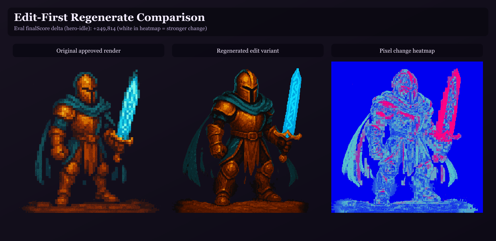
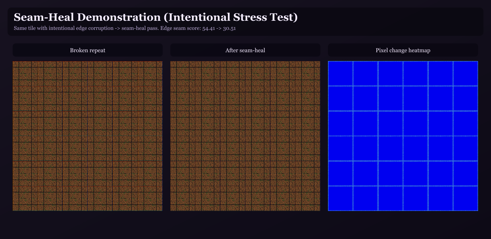
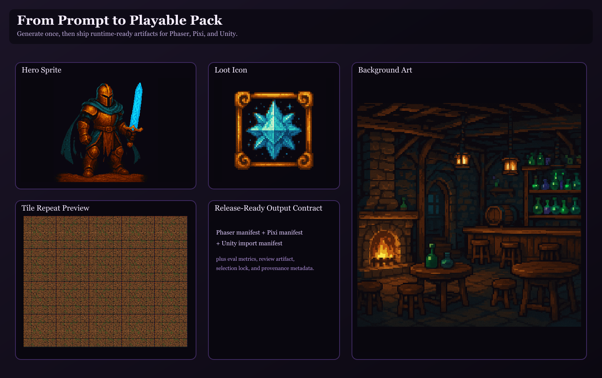

<p align="center">
  
</p>

<h1 align="center">LootForge</h1>

<p align="center">
  <strong>Manifest-driven CLI for generating, validating, and packaging runtime-ready game image assets.</strong>
</p>

<p align="center">
  <a href="https://github.com/Someblueman/lootforge/actions/workflows/ci.yml"></a>
  <a href="https://github.com/Someblueman/lootforge/actions/workflows/security.yml"></a>
  <a href="https://github.com/Someblueman/lootforge/releases/tag/v0.2.0"></a>
  <a href="https://github.com/Someblueman/lootforge/stargazers"></a>
</p>

<p align="center"><code>Current version: 0.2.0 (Emberforge)</code></p>

## Quick Start

Requirements: `node >=22`, `npm >=10`

Install:
```bash
npm install --cache .npm-cache
npm run build
```

Run a local validation pass (no provider API keys required):
```bash
node bin/lootforge.js init --out .
node bin/lootforge.js plan --manifest assets/imagegen/manifest.json --out assets/imagegen
node bin/lootforge.js validate --manifest assets/imagegen/manifest.json --out assets/imagegen
```

## Why LootForge

Most image generators stop at `prompt -> image`.
LootForge is designed for `prompt -> image -> game runtime artifact`.

Key outcomes:
- Consistent output structure
- Deterministic job metadata and provenance
- Inspectable validation and quality reports
- Runtime-ready atlas/manifests and portable pack artifacts

## Core Workflow

`init -> plan -> validate -> generate -> process -> atlas -> eval -> review -> select -> package`

## Core Capabilities

- `next` manifest schema with style kits, evaluation profiles, and spritesheet planning
- Provider selection: `openai`, `nano`, `local`, or `auto`
- Provider-aware normalization (`jpg -> jpeg`) with explicit unsupported-provider errors (no silent transparent fallback)
- Enforced provider runtime contract (manifest/env endpoint, timeout, retry, delay, concurrency)
- Deterministic job IDs keyed to normalized generation policy
- Multi-candidate generation with deterministic best-of scoring
- Optional VLM candidate gating (`generationPolicy.vlmGate`) with per-candidate traceability
- Post-process operators (`trim`, `pad/extrude`, `quantize`, `outline`, `resizeVariants`)
- Pixel-level acceptance checks with JSON report output
- Pack-level invariants in acceptance/eval (runtime-output uniqueness, spritesheet continuity, optional texture budgets)
- Atlas stage with optional TexturePacker integration plus reproducibility artifacts
- Pack assembly with runtime manifests and review artifacts

## Quick Links

- [Showcase](#showcase-what-lootforge-output-looks-like)
- [Quickstart (end-to-end)](#quickstart-end-to-end)
- [CLI Commands](#cli-commands)
- [Manifest Schema](#manifest-version-next)
- [Service Mode](#lootforge-serve)
- [Environment Variables](#environment-variables)
- [Status / Roadmap](#status--roadmap)

## Showcase: What LootForge Output Looks Like

The following visuals were generated from the repo showcase flow in `examples/showcase/`.

### 1) Edit-first regenerate loop

Re-run only one approved asset with a targeted art-direction instruction, then compare before/after plus a pixel-change heatmap:

```bash
node dist/cli/index.js regenerate \
  --out .tmp/showcase-0.2.0 \
  --provider openai \
  --edit true \
  --ids hero-idle \
  --instruction "Keep silhouette and palette, improve readability and rim light."
```



### 2) Seam-healed tile reliability

This visual runs a seam stress test (intentional edge corruption) and then applies LootForge seam-heal processing:

```bash
node dist/cli/index.js process --out .tmp/showcase-0.2.0 --strict true
```



### 3) One pipeline -> multi-runtime pack

Package the same processed assets for multiple runtime manifests:

```bash
node dist/cli/index.js package \
  --manifest examples/showcase/retro-fantasy/manifest.json \
  --out .tmp/showcase-0.2.0 \
  --runtimes pixi,unity \
  --strict false
```



To regenerate these showcase images end-to-end:

```bash
bash examples/showcase/generate-showcase.sh
```

## Requirements

- Node.js 22+ (recommended)
- npm 10+
- Optional: `texturepacker` for atlas sprite sheets
- Provider keys only for generation:
  - `OPENAI_API_KEY`
  - `GEMINI_API_KEY`

## Installation

### Local development

```bash
npm install --cache .npm-cache
npm run build
```

Run the built CLI:

```bash
node bin/lootforge.js --help
```

If you want global command access during development:

```bash
npm link
lootforge --help
```

## Quickstart (end-to-end)

```bash
# 1) Scaffold manifest + folders
node dist/cli/index.js init --out .

# 2) Plan jobs
node dist/cli/index.js plan \
  --manifest assets/imagegen/manifest.json \
  --out assets/imagegen

# 3) Validate manifest (strict by default)
node dist/cli/index.js validate \
  --manifest assets/imagegen/manifest.json \
  --out assets/imagegen

# 4) Generate images (requires provider API key)
node dist/cli/index.js generate \
  --out assets/imagegen \
  --provider openai

# 5) Process raw assets into runtime-ready outputs
node dist/cli/index.js process --out assets/imagegen

# 6) Build atlases, evaluate/select, then package artifact bundle
node dist/cli/index.js atlas --out assets/imagegen
node dist/cli/index.js eval --out assets/imagegen --strict true
node dist/cli/index.js review --out assets/imagegen
node dist/cli/index.js select --out assets/imagegen
node dist/cli/index.js package \
  --manifest assets/imagegen/manifest.json \
  --out assets/imagegen
```

## CLI Commands

The sections below focus on behavior, key outputs, and commonly used flags.
For full option coverage, run `lootforge <command> --help`.

### Command Summary

| Command | Primary purpose | Main artifacts |
| --- | --- | --- |
| `init` | Scaffold manifest + workspace folders | `manifest.json`, `raw/`, `processed/`, `jobs/` |
| `plan` | Validate manifest and emit provider job plans | `targets-index.json`, provider JSONL files |
| `validate` | Run manifest and optional image acceptance checks | `validation-report.json`, optional acceptance report |
| `generate` | Generate candidate images using selected provider(s) | Provider raw outputs + provenance |
| `regenerate` | Re-run approved targets via edit-first lock flow | Updated generated assets + lock-linked provenance |
| `process` | Apply post-processing and image acceptance | Processed catalog + acceptance report |
| `atlas` | Build atlas artifacts and reproducibility config | Atlas manifest and optional sheet assets |
| `eval` | Compute quality scoring and adapter telemetry | `eval-report.json` |
| `review` | Render review artifact from eval outputs | `review/review.html` |
| `select` | Materialize approved selections into lockfile | `locks/selection-lock.json` |
| `package` | Assemble runtime-ready distributable packs | `dist/packs/*` + final zip |
| `serve` | Start local HTTP service mode for tool/command execution | `v1` JSON endpoints |

### `lootforge init`

Scaffolds a starter workspace:
- `assets/imagegen/manifest.json`
- `assets/imagegen/raw/`
- `assets/imagegen/processed/`
- `assets/imagegen/jobs/`

Example:
```bash
lootforge init --out .
```

### `lootforge plan`

Validates the manifest and writes planned jobs:
- `<out>/jobs/targets-index.json`
- `<out>/jobs/openai.jsonl`
- `<out>/jobs/nano.jsonl`
- `<out>/jobs/local.jsonl`

Example:
```bash
lootforge plan --manifest assets/imagegen/manifest.json --out assets/imagegen
```

### `lootforge validate`

Outputs:
- `<out>/checks/validation-report.json`
- Optional: `<out>/checks/image-acceptance-report.json`
  - acceptance report may include top-level `packInvariants` summary when pack-level checks emit issues/metrics

Key flags:
- `--strict true|false` (default: `true`)
- `--check-images true|false` (default: `false`)
- `--images-dir <path>` optional override for acceptance checks

Example:
```bash
lootforge validate --manifest assets/imagegen/manifest.json --out assets/imagegen --strict true --check-images true
```

### `lootforge generate`

Runs provider generation from planned targets index.

Key flags:
- `--out <dir>`
- `--index <path>` optional (default `<out>/jobs/targets-index.json`)
- `--provider openai|nano|local|auto`
- `--ids a,b,c` optional subset

Example:
```bash
lootforge generate --out assets/imagegen --provider nano --ids enemy-1,ui-icon-attack
```

### `lootforge regenerate`

Re-runs selected targets from selection-lock state, with dedicated edit-first flow support.

Key flags:
- `--out <dir>`
- `--index <path>` optional (default `<out>/jobs/targets-index.json`)
- `--lock <path>` optional (default `<out>/locks/selection-lock.json`)
- `--ids a,b,c` optional subset (default: all lock-approved targets)
- `--edit true|false` (default: `true`)
- `--instruction "<text>"` optional instruction override for edit mode
- `--preserve-composition true|false` (default: `true`)
- `--provider openai|nano|local|auto`

Behavior:
- Uses selection lock approved outputs as edit-base input (`role=base`) for each regenerated target.
- Preserves lock provenance in `provenance/run.json` (`regenerationSource` metadata) for traceability.
- For safety, selection-lock output paths must resolve inside the active `--out` root.

Example:
```bash
lootforge regenerate --out assets/imagegen --edit true --ids player-idle
```

### `lootforge process`

Reads raw outputs, applies post-processing and acceptance checks, and writes:
- `<out>/assets/imagegen/processed/images/*` (or `<out>/processed/images/*` when `out` is already `assets/imagegen`)
- Compatibility mirror: `<out>/assets/images/*`
- `<out>/assets/imagegen/processed/catalog.json`
- `<out>/checks/image-acceptance-report.json`
  - includes optional `packInvariants` summary (`errors`, `warnings`, `issues`, `metrics`)

Example:
```bash
lootforge process --out assets/imagegen --strict true
```

### `lootforge atlas`

Reads generated images and atlas groups, then writes:
- `<out>/assets/atlases/manifest.json`
- Optional atlas sheets/json when TexturePacker is available

Example:
```bash
lootforge atlas --out assets/imagegen
```

### `lootforge package`

Assembles shareable outputs under:
- `<out>/dist/packs/<pack-id>/...`
- `<out>/dist/packs/game-asset-pack-<pack-id>.zip`

Key flags:
- `--runtimes <list>` optional comma-separated runtime exports (`phaser,pixi,unity`)

Notes:
- Phaser manifest output is always emitted as baseline compatibility.

Example:
```bash
lootforge package --out assets/imagegen --runtimes pixi,unity
```

### `lootforge serve`

Starts a local HTTP service wrapper for command execution (no auth/credit layer in core).

Key flags:
- `--host <host>` optional (default `127.0.0.1`)
- `--port <port>` optional (default `8744`)
- `--out <dir>` optional default output root used when request payload omits `out`

Core endpoints:
- `GET /v1/health`
- `GET /v1/tools`
- `GET /v1/contracts/generation-request`
- `POST /v1/tools/:name`
- `POST /v1/:name` (alias)
- `POST /v1/generation/requests` (canonical request -> `plan` + `generate` mapping)

Example:
```bash
lootforge serve --host 127.0.0.1 --port 8744 --out assets/imagegen
```

Service request/response contract details: `docs/SERVICE_MODE.md`

### `lootforge eval`

Runs hard/soft quality scoring and writes:
- `<out>/checks/eval-report.json`
- `eval-report.json` includes adapter health telemetry:
  - `adapterHealth.configured`: enabled adapters with command/URL configured
  - `adapterHealth.active`: adapters that returned at least one successful result
  - `adapterHealth.failed`: adapters that failed or were enabled but unconfigured
  - `adapterHealth.adapters[]`: per-adapter mode, target attempt/success/fail counters, warnings
- `eval-report.json` also includes VLM gate traceability when enabled:
  - `candidateVlm`: selected candidate VLM score/threshold/decision
  - `candidateVlmGrades[]`: per-candidate VLM score, threshold, pass/fail, evaluator mode, and reason
- `eval-report.json` acceptance metrics include edge-aware alpha boundary signals:
  - `alphaHaloRisk`
  - `alphaStrayNoise`
  - `alphaEdgeSharpness`
- `eval-report.json` may include a top-level `packInvariants` summary:
  - `errors`, `warnings`, and issue list
  - continuity metrics per animation (`maxSilhouetteDrift`, `maxAnchorDrift`)
  - texture budget metrics by evaluation profile

Optional CLIP/LPIPS/SSIM adapter execution:
- Enable adapters with:
  - `LOOTFORGE_ENABLE_CLIP_ADAPTER=1`
  - `LOOTFORGE_ENABLE_LPIPS_ADAPTER=1`
  - `LOOTFORGE_ENABLE_SSIM_ADAPTER=1`
- Configure each enabled adapter with either:
  - `LOOTFORGE_<NAME>_ADAPTER_CMD` (reads JSON from stdin and writes JSON to stdout)
  - `LOOTFORGE_<NAME>_ADAPTER_URL` (HTTP endpoint accepting JSON POST and returning JSON)
- Adapter response contract:
  - `{"metrics":{"alignment":0.82},"score":5}` or flat numeric JSON fields
  - `score` is applied as additive soft-score bonus/penalty in eval ranking
- Timeout controls:
  - Per-adapter: `LOOTFORGE_<NAME>_ADAPTER_TIMEOUT_MS`
  - Global fallback: `LOOTFORGE_ADAPTER_TIMEOUT_MS`
- Reference docs and runnable examples:
  - `docs/ADAPTER_CONTRACT.md`
  - `examples/adapters/stdin-adapter-example.js`
  - `examples/adapters/http-adapter-example.js`
- Adapter `referenceImages` payload paths are normalized to absolute paths under the active `--out` root.
- Optional VLM candidate hard gate:
  - configure per target with `generationPolicy.vlmGate`
  - evaluator transport:
    - `LOOTFORGE_VLM_GATE_CMD` (stdin/stdout JSON)
    - `LOOTFORGE_VLM_GATE_URL` (HTTP JSON POST)
  - timeout override: `LOOTFORGE_VLM_GATE_TIMEOUT_MS`
  - candidates below threshold are rejected before final candidate selection

Example:
```bash
lootforge eval --out assets/imagegen --strict true
```

### `lootforge review`

Builds a review artifact from eval data:
- `<out>/review/review.html`
- Includes per-target score breakdown details (candidate reasons/metrics, VLM gate traces, and adapter components/metrics/warnings).

Example:
```bash
lootforge review --out assets/imagegen
```

### `lootforge select`

Builds lockfile selections from provenance + eval:
- `<out>/locks/selection-lock.json`

Example:
```bash
lootforge select --out assets/imagegen
```

## Manifest (`version: "next"`)

Top-level fields:
- `version`: must be `next`
- `pack`: `{ id, version, license, author }` (required)
- `providers`: `{ default, openai?, nano?, local? }` (required)
  - each provider may define runtime defaults: `endpoint`, `timeoutMs`, `maxRetries`, `minDelayMs`, `defaultConcurrency`
  - `providers.local` may also define `baseUrl` (local endpoint alias)
- `styleKits[]` (required)
  - directed-synthesis scaffolding:
    - `styleReferenceImages[]?` (provider-specific style-image guidance inputs)
    - `loraPath?`, `loraStrength?` (`0..2`, requires `loraPath`)
- `consistencyGroups[]` (optional)
- `evaluationProfiles[]` (required)
- `atlas` options for packing defaults and per-group overrides
- `targets[]` (required)

`styleKits[].palettePath` behavior:
- When `target.palette` is unset, LootForge auto-loads colors from the style-kit palette file and applies them as the default exact palette policy.
- An explicit `target.palette` always takes precedence over style-kit defaults.

Per target:
- `id`, `kind`, `out`, `atlasGroup?`, `styleKitId`, `consistencyGroup`, `evaluationProfileId`
- `generationMode`: `text|edit-first`
- `edit-first` mode requires a provider with `image-edits` support (`openai`, `local`, and `nano` when using an image-edit-capable Gemini model)
- `edit.inputs[].path`: when used, must resolve inside the active `--out` root at runtime (`generate`, `eval`, and `regenerate`)
- `generationPolicy.background: "transparent"` requires a provider that supports transparent outputs (unsupported providers now fail validation)
- `generationPolicy.vlmGate?`: optional candidate gate (`threshold` defaults to `4` on a `0..5` scale, optional `rubric`)
- directed-synthesis scaffolding:
  - `controlImage?` with `controlMode?` (`canny|depth|openpose`) must be provided together
  - `generationPolicy.highQuality?`
  - `generationPolicy.hiresFix?` (`enabled?`, `upscale?`, `denoiseStrength?`)
- `prompt` (string or structured object) for non-spritesheet targets
- `provider?` (`openai|nano|local`)
- `acceptance`: `{ size, alpha, maxFileSizeKB }`
- optional generation/runtime fields (`generationPolicy`, `postProcess`, `runtimeSpec`, `model`, `edit`, `auxiliaryMaps`, `palette`, `tileable`, `seamThreshold`, `seamStripPx`, `seamHeal`, `wrapGrid`)
- `seamHeal`: optional pass for tileables (`enabled`, `stripPx`, `strength`) applied during process before final encode.
- `wrapGrid`: optional per-cell tile validation (`columns`, `rows`, optional seam thresholds) enforced in image acceptance.
- edge-aware boundary gates are configured via `evaluationProfiles[].hardGates`:
  - `alphaHaloRiskMax` (`0..1`)
  - `alphaStrayNoiseMax` (`0..1`)
  - `alphaEdgeSharpnessMin` (`0..1`)
- pack-level hard gates are configured via `evaluationProfiles[].hardGates`:
  - `packTextureBudgetMB` (`>0`)
  - `spritesheetSilhouetteDriftMax` (`0..1`)
  - `spritesheetAnchorDriftMax` (`0..1`)
- `kind: "spritesheet"` targets define `animations` and are expanded/assembled by the pipeline

Minimal example:

```json
{
  "version": "next",
  "pack": {
    "id": "my-pack",
    "version": "0.1.0",
    "license": "UNLICENSED",
    "author": "you"
  },
  "providers": {
    "default": "openai",
    "openai": { "model": "gpt-image-1" },
    "nano": { "model": "gemini-2.5-flash-image" },
    "local": { "model": "sdxl-controlnet", "baseUrl": "http://127.0.0.1:8188" }
  },
  "styleKits": [
    {
      "id": "fantasy-topdown",
      "rulesPath": "style/fantasy/style.md",
      "palettePath": "style/fantasy/palette.txt",
      "referenceImages": [],
      "lightingModel": "top-left key with warm fill"
    }
  ],
  "consistencyGroups": [
    {
      "id": "player-family",
      "description": "Shared protagonist style and silhouette rules.",
      "styleKitId": "fantasy-topdown",
      "referenceImages": []
    }
  ],
  "evaluationProfiles": [
    {
      "id": "sprite-quality",
      "hardGates": {
        "requireAlpha": true,
        "maxFileSizeKB": 512,
        "alphaHaloRiskMax": 0.08,
        "alphaStrayNoiseMax": 0.01,
        "alphaEdgeSharpnessMin": 0.8,
        "packTextureBudgetMB": 48,
        "spritesheetSilhouetteDriftMax": 0.2,
        "spritesheetAnchorDriftMax": 0.15
      }
    }
  ],
  "targets": [
    {
      "id": "player-idle",
      "kind": "sprite",
      "out": "player-idle.png",
      "atlasGroup": "actors",
      "styleKitId": "fantasy-topdown",
      "consistencyGroup": "player-family",
      "evaluationProfileId": "sprite-quality",
      "generationMode": "text",
      "prompt": "Top-down sci-fi pilot idle sprite with clear silhouette.",
      "postProcess": {
        "resizeTo": "512x512",
        "algorithm": "lanczos3",
        "stripMetadata": true
      },
      "acceptance": {
        "size": "512x512",
        "alpha": true,
        "maxFileSizeKB": 512
      }
    }
  ]
}
```

See also: `docs/manifest-schema.md`

Provider runtime precedence (`generate` / `regenerate`):
- target-level `generationPolicy.maxRetries` overrides provider retry defaults
- provider runtime defaults load from manifest `providers.<name>` config
- environment overrides can replace provider runtime defaults without manifest edits
- provider capability parity is enforced at startup (`supports(...)` must match declared capabilities)

## Output Contract

`lootforge package` emits:
- `dist/packs/<pack-id>/assets/images/*`
- `dist/packs/<pack-id>/assets/atlases/*`
- `dist/packs/<pack-id>/manifest/asset-pack.json`
- `dist/packs/<pack-id>/manifest/phaser.json`
- `dist/packs/<pack-id>/manifest/pixi.json` (when requested via `--runtimes`)
- `dist/packs/<pack-id>/manifest/unity-import.json` (when requested via `--runtimes`)
- `dist/packs/<pack-id>/review/catalog.json`
- `dist/packs/<pack-id>/review/contact-sheet.png`
- `dist/packs/<pack-id>/provenance/run.json`
- `dist/packs/<pack-id>/checks/validation-report.json`
- `dist/packs/<pack-id>/checks/image-acceptance-report.json`
- `dist/packs/<pack-id>/checks/eval-report.json` (when available)
- `dist/packs/<pack-id>/provenance/selection-lock.json` (when available)
- `dist/packs/<pack-id>/review/review.html` (when available)
- `dist/packs/game-asset-pack-<pack-id>.zip`

Stage outputs during generation flow:
- `raw/` stage: generated provider outputs
- `processed/` stage: deterministic post-processed outputs + catalog
- compatibility mirror under `assets/images/`
- atlas reproducibility artifact: `assets/atlases/atlas-config.json`

## Environment Variables

Provider keys:
- `OPENAI_API_KEY`: required for OpenAI generation
- `GEMINI_API_KEY`: required for Nano generation

Provider runtime overrides (env wins over manifest provider config):
- OpenAI:
  - `LOOTFORGE_OPENAI_ENDPOINT` (or `OPENAI_IMAGES_ENDPOINT`)
  - `LOOTFORGE_OPENAI_EDITS_ENDPOINT` (or `OPENAI_EDITS_ENDPOINT`)
  - `LOOTFORGE_OPENAI_TIMEOUT_MS` (or `OPENAI_TIMEOUT_MS`)
  - `LOOTFORGE_OPENAI_MAX_RETRIES` (or `OPENAI_MAX_RETRIES`)
  - `LOOTFORGE_OPENAI_MIN_DELAY_MS` (or `OPENAI_MIN_DELAY_MS`)
  - `LOOTFORGE_OPENAI_DEFAULT_CONCURRENCY` (or `OPENAI_DEFAULT_CONCURRENCY`)
- Nano/Gemini:
  - `LOOTFORGE_NANO_ENDPOINT` (or `GEMINI_API_BASE`)
  - `LOOTFORGE_NANO_TIMEOUT_MS` (or `GEMINI_TIMEOUT_MS`)
  - `LOOTFORGE_NANO_MAX_RETRIES` (or `GEMINI_MAX_RETRIES`)
  - `LOOTFORGE_NANO_MIN_DELAY_MS` (or `GEMINI_MIN_DELAY_MS`)
  - `LOOTFORGE_NANO_DEFAULT_CONCURRENCY` (or `GEMINI_DEFAULT_CONCURRENCY`)
- Local diffusion:
  - `LOOTFORGE_LOCAL_ENDPOINT` (or `LOCAL_DIFFUSION_BASE_URL`)
  - `LOOTFORGE_LOCAL_TIMEOUT_MS` (or `LOCAL_DIFFUSION_TIMEOUT_MS`)
  - `LOOTFORGE_LOCAL_MAX_RETRIES` (or `LOCAL_DIFFUSION_MAX_RETRIES`)
  - `LOOTFORGE_LOCAL_MIN_DELAY_MS` (or `LOCAL_DIFFUSION_MIN_DELAY_MS`)
  - `LOOTFORGE_LOCAL_DEFAULT_CONCURRENCY` (or `LOCAL_DIFFUSION_DEFAULT_CONCURRENCY`)

Eval adapter toggles:
- `LOOTFORGE_ENABLE_CLIP_ADAPTER`: enable CLIP adapter execution in `lootforge eval`
- `LOOTFORGE_ENABLE_LPIPS_ADAPTER`: enable LPIPS adapter execution in `lootforge eval`
- `LOOTFORGE_ENABLE_SSIM_ADAPTER`: enable SSIM adapter execution in `lootforge eval`

Eval adapter transports:
- `LOOTFORGE_CLIP_ADAPTER_CMD` or `LOOTFORGE_CLIP_ADAPTER_URL`
- `LOOTFORGE_LPIPS_ADAPTER_CMD` or `LOOTFORGE_LPIPS_ADAPTER_URL`
- `LOOTFORGE_SSIM_ADAPTER_CMD` or `LOOTFORGE_SSIM_ADAPTER_URL`

Eval adapter timeout controls:
- `LOOTFORGE_ADAPTER_TIMEOUT_MS`: global timeout (ms)
- `LOOTFORGE_<NAME>_ADAPTER_TIMEOUT_MS`: per-adapter timeout override (ms)

VLM gate transport:
- `LOOTFORGE_VLM_GATE_CMD`: command transport for VLM candidate gate scoring
- `LOOTFORGE_VLM_GATE_URL`: HTTP transport for VLM candidate gate scoring
- `LOOTFORGE_VLM_GATE_TIMEOUT_MS`: timeout override for VLM gate requests (ms)

Service mode:
- `LOOTFORGE_SERVICE_HOST`: default host for `lootforge serve`
- `LOOTFORGE_SERVICE_PORT`: default port for `lootforge serve`
- `LOOTFORGE_SERVICE_OUT`: default output root injected when service payload omits `out`

No network keys are required for `init`, `plan`, `validate`, `atlas`, or `package`.

## Development

Local verification commands:
- `npm run typecheck`
- `npm run build`
- `npm test`
- `npm run test:unit`
- `npm run test:integration`
- `npm run test:coverage:critical`

`0.3.0` release-train branch policy:
- Keep `main` release-only until `0.3.0` is ready to cut.
- Use `release/0.3` as the integration branch for ongoing work.
- Branch feature work from `release/0.3` and PR back into `release/0.3`.
- Release by PR `release/0.3 -> main`, then tag `v0.3.0`.

## Status / Roadmap

`0.2.0` (`Emberforge`) is the public beta foundation release.

Release roadmap:
- `0.2.0` (`Emberforge`): public beta foundation (edit/regenerate workflow, score transparency, tile/palette reliability)
- `0.3.0` (`Tempered Steel`): control and consistency upgrades (group-level drift scoring, provider edit parity)
- `0.4.0` (`Anvilheart`): local production path (ControlNet contracts + LoRA/provenance maturity)
- `0.5.0` (`Runesmelter`): team scale and integration maturity (CI regressions + broader runtime export presets)
- `1.0.0` (`Mythic Foundry`): GA contract stabilization and public operational readiness

See `docs/ROADMAP.md` for detailed scope, per-version `Upcoming` vs `Future` queues, exit criteria, and cross-version trackers.
See `docs/ENGINE_TARGETING.md` for framework market/compatibility analysis and runtime export strategy.
See `CHANGELOG.md` for versioned release notes and `docs/RELEASE_WORKFLOW.md` for release/changelog/showcase maintenance.
